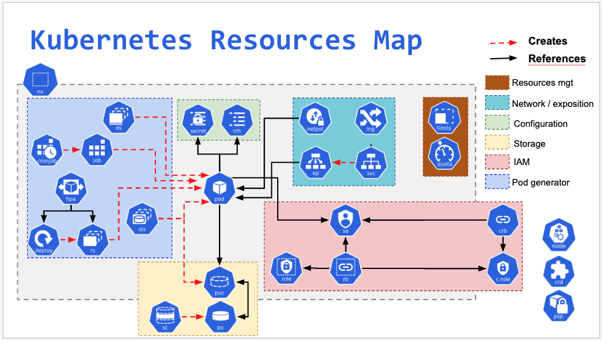
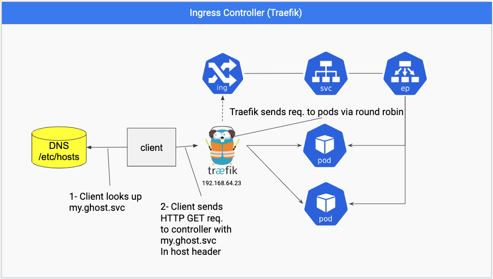
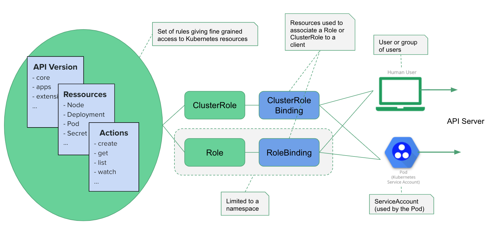
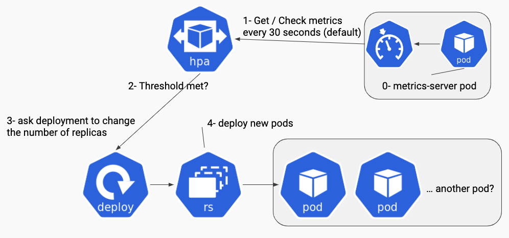

# Practical Kubernetes Exercices

This repo provides some resources to learn Kubernetes through practical exercises for self study to learn how easy it is to understand and master Kubernetes complexity and problems.

Kubernetes is easy to understand, even if it looks hard at the first look on the icons or the resources map, this course is about to help you to understand K8s and learn how to start!





## Prerequisites

It would be nice if you know what `kubectl` is and have a basic understanding of running conatiners with docker / containerd or cri-o.

## Preparation

To get prepared please install at least kubectx and kns with krew from this list and make sure to have bash completion for kubectl in place:

## Tools we use

- [mkcert](https://github.com/FiloSottile/mkcert)
- watch  
  - Mac setup:
    ````
    brew install watch
- [oh-my-zsh](https://github.com/ohmyzsh/ohmyzsh)
  - activate autocompletion
    - [Mac setup](https://docs.brew.sh/Shell-Completion)
    - [kubectl plugin](https://github.com/ohmyzsh/ohmyzsh/tree/master/plugins/kubectl)
- [git](https://git-scm.com/)
- [kubectl](https://kubernetes.io/docs/tasks/tools/install-kubectl/)  
  - mac setup:
    ```
    brew install kubernetes-cli
- [kubectx & kubens](https://github.com/ahmetb/kubectx)


[The Golden Kubernetes Tooling and Helpers list](http://bit.ly/kubernetes-tooling-list)

We can use any Kubernetes cluster (> 1.21) on our local machine or in the cloud. For online trainings we recommend to have either k3s installed with k3d, use Kind, or Docker for Desktop.  

We'll use some slides from:

[Kubernauts Kubernetes Trainings Slides](https://goo.gl/Hzk2sd)

and refer to some resources from:

[Kubernauts Kubernetes Learning Resources List](https://goo.gl/Rywkpd)

## Kubernetes  Guides

### Networking

The purpose of [this website](https://www.tkng.io/) is to provide an overview of various Kubernetes networking components with a specific focus on exactly how they implement the required functionality.

The guide is split into multiple parts which can be studied mostly independently, however they all work together to provide a complete end-to-end cluster network abstractions.

Where possible, every topic in this guide will include a dedicated [hands-on labs](https://www.tkng.io/lab/) which can be spun up locally in a matter of minutes. 

### Security
 
The Security checklist aims at providing a basic list of guidance with links to more comprehensive documentation on each topic. It does not claim to be exhaustive and is meant to evolve.

1- https://kubernetes.io/docs/concepts/security/security-checklist/

2- https://github.com/magnologan/awesome-k8s-security

3- https://github.com/freach/kubernetes-security-best-practice

4- https://medium.com/@seifeddinerajhi/kubernetes-security-assessment-guidelines-and-necessary-checklist-9a326f341b68

5- https://medium.com/@seifeddinerajhi/owasp-kubernetes-top-10-a-comprehensive-guide-f03af6fd66ed

5- https://eksclustergames.com:  Kubernetes CTF (Capture The Flag) challenges for EKS 

### Storage

- The key concepts of Kubernetes storage, including [PVs, PVCs, and StorageClass](https://medium.com/@seifeddinerajhi/understanding-storage-in-kubernetes-ee2c19001aae)

### Misc

- Kelsey Hightower's open-source guide, [Kubernetes the Hard Way](https://github.com/kelseyhightower/kubernetes-the-hard-way), goes through how to bootstrap a Kubernetes cluster without the use of installers or scripts. 


- [Learnk8s](https://learnk8s.io/): Develop the knowledge and skills to get the most out of Kubernetes with hands-on online courses and instructor-led classes.

- [Introduction to Kubernetes Lecture Notes](https://github.com/kaan-keskin/introduction-to-kubernetes/tree/main): Notes about Kubernetes resources  

- [Kubernetes Handbook](https://github.com/rootsongjc/kubernetes-handbook)

- [Kubeapps](https://github.com/vmware-tanzu/kubeapps): A web-based UI for deploying and managing applications in Kubernetes clusters

- [Start learning Kubernetes today](https://kubebyexample.com/)

- [Step by step guide to learning Kubernetes](https://roadmap.sh/kubernetes)


- [Kubernetes mind map](https://betterprogramming.pub/6-important-things-you-need-to-run-kubernetes-in-production-d573d61258c5): 6 Important Things You Need to Run Kubernetes in Production.

### Useful aliases

<details><summary>Expand here to see the solution</summary>
<p>

```yaml
alias k="kubectl"
alias kx="kubectx"
alias kn="kubens"
alias kgp="kubectl get pods"
alias kgel="k get events --sort-by=.metadata.creationTimestamp"
```
</p>
</details>


## Kubectl CheatSheet and Goodies

https://kubernetes.io/docs/reference/kubectl/cheatsheet/

https://github.com/dennyzhang/cheatsheet-kubernetes-A4

<details><summary>Expand here to see the solution</summary>
<p>

```bash
k get events --sort-by=.metadata.creationTimestamp # List Events sorted by timestamp

k get services --sort-by=.metadata.name # List Services Sorted by Name

k get pods --sort-by=.metadata.name

k get endpoints

k explain pods,svc

k get pods -A # --all-namespaces 

k get nodes -o jsonpath='{.items[*].spec.podCIDR}'

k get pods -o wide

k get pod my-pod -o yaml --export > my-pod.yaml  # Get a pod's YAML without cluster specific information

k get pods --show-labels # Show labels for all pods (or other objects)

k get pods --sort-by='.status.containerStatuses[0].restartCount'

k cluster-info

k api-resources

k api-resources -o wide

kubectl api-resources --verbs=list,get # All resources that support the "list" and "get" request verbs

k get apiservice
```
</p>
</details>

### k create namespace imperative via declarative

<details><summary>Expand here to see the solution</summary>
<p>

```yaml
k create ns <namespace name, e.g. your name or your project!>
k create ns --dry-run test -o yaml > test-ns.yaml
k create -f test-ns.yaml
k delete ns test
```

</p>
</details>

### k create / run pods or deploymens with dry-run

<details>
   <summary>Expand here to see the solution</summary>
<p>

```yaml
# old school (going to get deprecated)
k run --generator=run-pod/v1 <pod name> --image=<image name> --dry-run -o yaml > <podname.yaml>

k run --generator=run-pod/v1 "nginx-pod" --image=nginx -o yaml --dry-run > nginx-pod.yaml

or

k run --restart=Never <pod name> --image=<image name> --dry-run -o yaml > <podname.yaml>

or (new school with --dry-run=client)

k run nginx-pod --image=nginx -o yaml --dry-run=client > nginx-pod.yaml

k create <object> <name> <options> --dry-run -o yaml > <objectname.yaml>

k create deployment nginx-deployment --image=nginx --dry-run -o yaml > nginx-deployment.yaml

cat nginx-pod.yaml

cat nginx-deployment.yaml

k create -f nginx-pod.yaml

# create a service via exposing the pod

k expose pod nginx-pod --port=80

k get svc

k port-forward service/nginx-pod 8080:80

or

k proxy

open http://127.0.0.1:8001/api/v1/namespaces/default/pods/nginx-pod/proxy/

# open a new terminal session

curl http://127.0.0.1:8080/

k delete all --all # with caution!!!

k create -f nginx-deployment.yaml

k get all

k get all -A

k expose deployment nginx-deployment --port=80

k port-forward service/nginx-deployment 8080:80

k scale --replicas 3 deployment nginx-deployment

k edit deployment nginx-deployment

vi nginx-deployment.yaml # adapt the number of replicas, e.g. to 2

k apply -f nginx-deployment.yaml

```
</p>
</details>

### k get events and logs, describe objects

<details><summary>Expand here to see the solution</summary>
<p>

```yaml
kx
kn
k delete all --all # with caution!!!
k apply -f 0-nginx-all.yaml
k get all
# where is the ingress?
k get ingress # ingress objects are not namespaced
k get events
k get events -A
k get events -n <namespace name>
k logs nginx-<press tab>
k describe pod nginx-<press tab>
k describe deployment nginx
k describe replicasets nginx-<press tab>
```
</p>
</details>

### Merging contexts (e.g. merge 2 kubeconfigs from 2 cluster contexts)

Sometimes you'll need to merge multiple kubeconfigs into a single file, here you go:

<details><summary>Expand here to see the solution</summary>
<p>

```bash
KUBECONFIG=file1:file2:file3 kubectl config view --merge --flatten > my_new_kubeconfig
or
cp ~/.kube/config ~/.kube/config.bak
KUBECONFIG=/my/new/kubeconfig:~/.kube/config.bak kubectl config view --flatten > my_new_kubeconfig
# test it
export KUBECONFIG=my_new_kubeconfig
kx
cp my_new_kubeconfig ~/.kube/config
```
</p>
</details>

Don't miss: Mastering the KUBECONFIG file by Ahmet Alp Balkan:

https://ahmet.im/blog/mastering-kubeconfig/

### Kubernetes Secrets are not secret

Secrets are resources containing keys with base64 encoded values. Secrets are not encrypted by default, they are only encoded and can get decoded easily by everyone who has access to a namespace or to the whole cluster.

Secret values can be exposed to pods as environment variables or mounted as files.

In order to create a secret from a text file, you can run the following, This creates a generic secret named secretname and automatically encodes the value as base64:

<details><summary>Expand here to see the solution</summary>
<p>

```yaml
echo -n "yourvalue" > ./secret.txt
k create secret generic secretname --from-file=./secret.txt
k describe secrets secretname
k get secret secretname -o yaml
echo 'eW91cnZhbHVl' | base64 --decode
# or
k create secret generic mysecret --dry-run -o yaml --from-file=./secret.txt > secret.yaml
k create -f secret.yaml
# or
k create secret generic mysecret --dry-run -o yaml --from-literal=secret.txt=yourvalue > secret.yaml
```
</p>
</details>

#### Further reading:

Since K8s secrets are not so secret, there are some ways to keep you secrets secret:

https://learnk8s.io/kubernetes-secrets-in-git

https://kubernetes.io/docs/tasks/inject-data-application/distribute-credentials-secure/#create-a-pod-that-has-access-to-the-secret-data-through-environment-variables


### Kubernetes ConfigMaps

A ConfigMap is an object consisting of key-value pairs which can be injected into your application.

With a ConfigMap you can separate configuration from your Pods. This way, you can prevent hardcoding configuration data.

ConfigMaps are useful for storing and sharing non-sensitive, unencrypted configuration information. Sensitive information should be stored in a Secret instead.

Exercise:

Create a ConfigMap named kubernauts that contains a key named dev with the value ops.

With the --from-literal argument passed to the k create configmap command you can create a ConfigMap containing a text value.

<details><summary>Expand here to see the solution</summary>
<p>

```yaml
k create cm kubernauts --from-literal=dev=ops --dry-run -o yaml > cm-kubernauts.yaml
cat cm-kubernauts.yaml
echo -n "ops" > dev
k create cm kubernauts --from-file=./dev
k get cm
k describe cm kubernauts
k delete cm kubernauts
k create -f cm-kubernauts.yaml
k describe cm kubernauts
```
</p>
</details>

Using this ConfigMap, we can inject data in our application:

<details><summary>Expand here to see the solution</summary>
<p>

```yaml
cat 0-nginx-configmap.yaml
k create -f 0-nginx-configmap.yaml
```
</p>
</details>


## Whoami, Whoareyou and Whereami Problems

### What We’ll Do

We’ll use a pre-made container — containous/whoami — capable of telling you where it is hosted and what it receives when you call it.

If you'd like to build the container image with docker, do:

<details><summary>Expand here to see the solution</summary>
<p>

```yaml
git clone https://github.com/containous/whoami.git
docker build -t whoami .
docker tag whoami kubernautslabs/whoami
docker push kubernautslabs/whoami
docker images | head
```

</p>
</details>

We’ll define two different deployments, a whoami and a whoareyou deployment that will use `containous/whoami` container image.

We’ll create a deployment to ask Kubernetes to deploy 2 replicas of whoami and 3 replicas of whoareyou.

We’ll define two services, one for each of our Pods.

We’ll define Ingress objects to define the routes to our services to the outside world.

We’ll use our Nginx Ingress Controller on our Rancher Cluster.

Explanations about the file content of whoami-deployment.yaml:

We define a “deployment” (kind: Deployment)

The name of the object is “whoami-deployment” (name: whoami-deployment)

We want two replica (replicas: 2)

It will deploy pods that have the label app:whoami (selector: matchLabels: app:whoami)

Then we define the pods with the (template: …) which will have the whoami label (metadata:labels:app:whoami)

The Pods will host a container using the image containous/whoami (image:containous/whoami)

<details><summary>Expand here to see the solution</summary>
<p>

```yaml
k apply -f 1-whoami-deployment.yaml
k get all
# we expose the deployment with a service of type ClusterIP
k create -f 1-whoami-service-ClusterIP.yaml
k get svc
k port-forward service/whoami-service 8080:80
# in a new terminal session call
curl 127.0.0.1:8080
k delete svc whoami-service
# create a service of type NodePort
k create -f 1-whoami-service-nodeport.yaml
k get svc
curl csky08:30056 # adapt the nodeport for your env. please !
curl csky09:30056
curl csky10:30056
k delete svc whoami-service-nodeport
k create -f 1-whoami-service-loadbalancer.yaml
k get svc
curl <EXTERNAL-IP> # the external-ip is given from the LB IP pool above
k create -f 2-whoareyou-all.yml
k get all
k get svc
k get ing
curl <HOSTS value from ingress>
# are you happy? ;-)
```

</p>
</details>

## DNS based Service discovery with whereami kubia pod

### What We’ll Do

We'll use a slightly extended node.js app (which is a simple web server) from the [Kubernetes in Action book by Marko Lukša](https://www.amazon.com/-/en/Marko-Luksa/dp/1617293725) in 2 different namespaces ns1 and ns2 to demonstrate the DNS based services discovery. 

A service provides a Virtual IP (VIP) address, which means the Service IP is not bound to a physical network interface. A service acts like an internal loadbalancer in K8s! The magic of of routing trafic through the VIP is implemented by IPtable rules managed by kube-proxy!

A service can be called through its FQDN in the form of:

`$SERVICE_NAME.$NAMESPACE.svc.cluster.local`

<details><summary>Expand here to see the solution</summary>
<p>

```yaml
cd whereami
k create ns ns1
k create ns ns2
kn ns1
cat kubia-deployment.yaml   
k create -f kubia-deployment.yaml
k create -f kubia-deployment.yaml -n ns2
k expose deployment kubia
k get svc
k expose deployment kubia -n ns2
k get svc -n ns2
k exec -it kubia-<press tab> -- curl kubia.ns2.svc.cluster.local:8080
k scale deployment kubia -n ns2 --replicas 3
# repeat the service call many times and see how loadbalancing works
k exec -it kubia-<press tab> -- curl kubia.ns2.svc.cluster.local:8080
k exec -n ns2 -it kubia-<press tab> -- curl kubia.ns1.svc.cluster.local:8080
k exec -it kubia-<press tab> -- ping kubia.ns2.svc.cluster.local
--> PING kubia.ns2.svc.cluster.local (10.43.109.89) 56(84) bytes of data.
# you don't get any pong, why?
# ssh into a node and examine the IPtable rules
sudo iptables-save | grep kubia
```
</p>
</details>

### Headless Services for Stickiness


As we learned services are exposed by default through the type ClusterIP, they work as an internal layer 4 load-balancer and provide a VIP with a stable DNS address, where the clients can connect to. The service forwards the connections to one of the pods which are backing the service via round robin.

This works fine and is desired for stateless apps which need to connect to one of the pods randomly and gain more performance through trafic routing via load balancing.

But in some cases where stickiness is needed and the clients need to connect to a particular pod for session or data stickiness, then we need to define our service without ClusterIP, which is by default the head of the service (that's the VIP).

To do that we need to define our service as a `headless` service, let's see that in action with the whereami service and our utils pod.

In the following we expose the kubia deployment as a headless service by setting the ClusterIP to `None`, scale the deployment and do a DNS query to both services with `host kubia-headless` and `host kubia-clusterip` from within the util client pod. As you'll see our client pod always connects to the first IP from the DNS response, if we curl the headless service. This means no load balancing happens, the call is `Sticky`!

The second curl to the service with ClusterIP does load balancing and distributes the traffic between pods.

<details><summary>Expand here to see the solution</summary>
<p>

```yaml
k delete svc kubia
k expose deployment kubia --name kubia-headless --cluster-ip None
k expose deployment kubia --name kubia-clusterip
k expose deployment kubia --name kubia-lb --type=LoadBalancer
k scale deployment kubia --replicas 3
k run --generator=run-pod/v1 utils -it --image kubernautslabs/utils -- bash
# inside the utils container
host kubia-headless
host kubia-clusterip
# what is the difference here?
for i in $(seq 1 10) ; do curl kubia-headless:8080; done
# hits kubia only on one node? 
for i in $(seq 1 10) ; do curl kubia-clusterip:8080; done
# does load balancing via the head ;-)
exit
mkcert '*.whereami.svc'
k create secret tls whereami-secret --cert=_wildcard.whereami.svc.pem --key=_wildcard.whereami.svc-key.pem
cat kubia-ingress-tls.yaml
k create -f kubia-ingress-tls.yaml
# Please provide the host entry mapping in your /etc/hosts file like this:
# 192.168.64.23 my.whereami.svc
# the IP should be the IP of the traefik loadbalancer / ingress controller
curl https://my.whereami.svc
for i in $(seq 1 10) ; do curl https://my.whereami.svc; done
# the ingress controller does load balancing, although the kubia-headless is defined as the backend with serviceName: kubia-headless!
```

</p>
</details>

## Ingress with TLS



Often we need to use an ingress object to provide path based or (sub-) domain based routing with TLS termination and other capabilities defined through annotations in the ingress resource.

By creating an ingress for a service, the ingress controller will create a single entry-point to the defined service in the ingress resource on every node in the cluster.

In the follwoing we're using the traefik ingress controller and an ingress object to provide path based or (sub-) domain based routing with TLS termination with a valid mkcert made TLS certificate on our lab environment.


<details><summary>Expand here to see the solution</summary>
<p>

```yaml
cd ..
kn default
mkcert '*.ghost.svc'
k create secret tls ghost-secret --cert=_wildcard.ghost.svc.pem --key=_wildcard.ghost.svc-key.pem
# alternatively, if you can't or you don't want to use mkcert, you can create a selfsigned cert with:
# openssl genrsa -out tls.key 2048
# openssl req -new -x509 -key tls.key -out tls.cert -days 360 -subj /CN=my.ghost.svc
# k create secret tls ghost-secret --cert=tls.cert --key=tls.key
cat 3-ghost-deployment.yaml
k create -f 3-ghost-deployment.yaml
k expose deployment ghost --port=2368
cat 3-ghost-ingress-tls.yaml
k create -f 3-ghost-ingress-tls.yaml
# Please provide the host entry mapping in your /etc/hosts file like this:
# 192.168.64.23 my.ghost.svc admin.ghost.svc
# the IP should be the IP of the traefik loadbalancer / ingress controller
open https://my.ghost.svc
open https://admin.ghost.svc/ghost
# change the service type to LoadBalancer and access ghost with the loadbalancer IP on port 2368 or on any other node (works on k3s with trafik only), e.g.:
open http://node2:2368
# scale the deployment to have 2 replicas and see how the backend ghost backened https://admin.ghost.svc/ghost doesn't work.
```

</p>
</details>

## Multi-Container Pods

Create a Pod with two containers, both with image alpine and command "echo hello; sleep 3600". Connect to the second container and run 'ls'.

The easiest way to do it is to create a pod with a single container and save its definition in a YAML file and extend it with an additional container:

<details><summary>Expand here to see the solution</summary>
<p>

```yaml
k run alpine-2-containers --image=alpine --restart=Never -o yaml --dry-run -- /bin/sh -c 'echo hello;sleep 3600' > alpine-pod.yaml
```

Copy/paste the container related values, so your final YAML should contain the following two containers (make sure those containers have a different name):

```YAML
containers:
  - args:
    - /bin/sh
    - -c
    - echo hello;sleep 3600
    image: alpine
    name: alpine1
    resources: {}
  - args:
    - /bin/sh
    - -c
    - echo hello;sleep 3600
    image: alpine
    name: alpine2
    resources: {}
```

```yaml
k create -f alpine-pod-2-containers.yaml # alpine-pod-2-containers.yaml is in this repo
# exec / ssh into to the alpine2 container
k exec -it alpine-2-containers -c alpine2 -- sh
ls
exit

# or just an one-liner
k exec -it alpine2 -c alpine2 -- ls

# cleanup
k delete pod alpine-2-containers
```

</p>
</details>


### Shared Volume

We'll extend the above alpine-2-containers with a shared volume of type emptyDir named `share` with a volumeMount for each container with a mountPath `/tmp/share1` and `/tmp/share2` as follow:

<details><summary>Expand here to see the solution</summary>
<p>

```yaml
cat alpine-pod-share-volumes.yaml
k apply -f alpine-pod-share-volumes.yaml
k exec -it alpine-2-containers-share-volume -c alpine1 -- sh
touch /tmp/share1/sharefile
echo "test-share1" > /tmp/share1/sharefile
cat /tmp/share1/sharefile
exit
k exec -it alpine-2-containers-share-volume -c alpine2 -- cat /tmp/share2/sharefile
```

</p>
</details>

## Security

Kubernetes Security is a huge topic and security hardening is a nice problem which everyone has to implement according to their security requirements and the governance model of their organization. We're going only to scratch the surface of K8s security here and highly recommend to go through the following resources by Michael Hausenblas, Liz Rice and the community.

https://kubernetes-security.info/

https://learn.hashicorp.com/vault/getting-started-k8s/sidecar

https://github.com/k8s-sec/k8s-sec.github.io


### Service Accounts

In K8s each namespace has a default ServiceAccount, named `default`. A ServiceAccount is a namespaced resource used by containers running in a Pod, to communicate with the API server of the Kubernetes cluster. ServiceAccounts with limited permissions are often used to apply the principle of least priviledge.

```bash
k get sa --all-namespaces | grep default
k get sa default -o yaml
k get secret default-<press tab> -o yaml
```

The data key of this Secret has several key/pairs:

```yaml
apiVersion: v1
kind: Secret
data:
  ca.crt: LS0tLS1CRUdJTi...
  namespace: ZGVmYXVsdA==
  token: ZXlKaGJHY2lP...
metadata:
  annotations:
    kubernetes.io/service-account.name: default
...
```

The token is the Base64 encoding of the JWT used to authenticate against the API server.
Let's get the token and head to jwt.io and use the debugger to decode the token.

```bash
kubectl run -it alpine --restart=Never --image=alpine -- sh
ls /var/run/secrets/kubernetes.io/serviceaccount/
cat /var/run/secrets/kubernetes.io/serviceaccount/token
exit
open https://jwt.io/
```

Paste the token and get the payload, which looks similar to this:

```
{
  "iss": "kubernetes/serviceaccount",
  "kubernetes.io/serviceaccount/namespace": "default",
  "kubernetes.io/serviceaccount/secret.name": "default-token-24pbl",
  "kubernetes.io/serviceaccount/service-account.name": "default",
  "kubernetes.io/serviceaccount/service-account.uid": "147e134a-43d0-4c76-ad01-bccc59f8acb9",
  "sub": "system:serviceaccount:default:default"
}
```

We can see the service account default is linked to the namespace where it exists and is using the secret default-token-24pbl. This token is available in the filesystem of each container of the Pod of the attached ServiceAccount.

### Using a Custom ServiceAccount

A Service Account on its own is on not so useful, we need to provide rome rights and permissions to it through a set of rules defined through roles or cluster roles using the RBAC implementation in K8s.  


### RBAC (Role Based Access Control)

RBAC in K8s is activated by default and helps to provide access to resources (objects) like namespaces, pods, services, etc. to those Subjects or Entities like users, group or service accounts who need access to some resources and deny access to other resources who do not need access to them. RBAC increases security in K8s projects and shall be defined through a governance model in each organization (but in the theorie, you know we are all admins ;-)).

RBAC is implemented through Role, ClusterRole, RoleBinding, and ClusterRoleBinding.

#### Role

A Role defines what you or a subject can do to a set of resources, like get, set, delete, etc.A Role contains a set of rules which define a set of permissions. Roles are used to assigning permissions to resources on the namespace level.

#### ClusterRole

Similar to Role, ClusterRole can grant permissions on the Cluster Level such as giving resource permissions across all namespaces in the cluster.

#### RoleBinding and ClusterRoleBinding

RoleBinding and ClusterRoleBinding are used to grant permissions and priviledges to Subjects or Entities on the namespace (project RoleBinding) level or on the cluster level (ClusterRoleBinding).



#### What We’ll Do

We create a new namespace myapp and a new custom ServiceAccount `mysa`, create a new role `podreader` with the permission to get and list pods and create a rolebinding `mypodviewer` to bind the ServiceAccount to the role podreader in the namespace `myapp`.

<details><summary>Expand here to see the solution</summary>
<p>

```yaml
k get clusterroles | wc -l
# 62
k get clusterroles
k describe clusterrole view
k describe clusterrole view | grep pods
# the view role allows your application access to many other resources such as deployments and services.
k create namespace myapp
k -n=myapp create serviceaccount mysa
k -n myapp create role podreader --verb=get --verb=list --resource=pods
k -n myapp describe role/podreader
# nice, the role podreader can only view now, but we need to attach the role podreader to our application, represented by the service account myapp. 
k -n myapp create rolebinding mypodviewer --role=podreader --serviceaccount=myapp:mysa
k -n myapp describe rolebindings mypodviewer
k -n myapp auth can-i --as=system:serviceaccount:myapp:mysa list pods
# yes :-)
k -n myapp auth can-i --as=system:serviceaccount:myapp:mysa list services
# no :-)
```
</p>
</details>

We extend our alpine pod with the key `serviceAccountName` and the value `mysa`, apply the change and run a shell in the alpine-pod, get the toke belonging to the `mysa` ServiceAccountand use it to list the pods in the default namespace and the myapp namespace to see the differences:

<details><summary>Expand here to see the solution</summary>
<p>

```yaml

kn myapp
cat alpine-pod-service-account.yaml
k apply -f alpine-pod-service-account.yaml
k describe pod alpine-sa
k get sa
k get secrets
k exec -it alpine-sa -- sh
apk add curl
TOKEN=$(cat /run/secrets/kubernetes.io/serviceaccount/token)
curl -H "Authorization: Bearer $TOKEN" https://node1:6443/api/v1/namespaces/default/pods/ --insecure
curl -H "Authorization: Bearer $TOKEN" https://node1:6443/api/v1/namespaces/myapp/pods/ --insecure
# what works, what doesn't work?

```
</p>
</details>

#### Further reading:

[Kubernetes Tips: Using a ServiceAccount](https://medium.com/better-programming/k8s-tips-using-a-serviceaccount-801c433d0023)

#### Permission Manager

--> ToDo

## 3-Tier App (MVC)

Please read the README and the related blog post in the [subfolder](3-tier-app/README.md)  3-tier-app and try to understand and get the todo list app up and running.

# Day 2 Operation

Day 2 operation is mainly about implementing some principles like selfhealing and autoscaling for our apps AND the infrastructure components like nodes and K8s components itself and define resources limits, liveness and readiness probes for our apps, run continious security auditing, apply GitOps principles and style, etc.

In this first section we'll go through app auto scaling with Horizontal Pod Autoscaler.



## Pod AutoScaling with HPA (Horizontal Pod Autoscaler)

```bash
kubectl run hpa-example --image=k8s.gcr.io/hpa-example --requests=cpu=200m --expose --port=80
# create HPA based on CPU usage
kubectl autoscale deployment hpa-example --cpu-percent=50 --min=1 --max=10
# In another terminal run
kubectl run -i --tty generate-load --image=busybox /bin/sh
# Inside the above container run a loop bash command to stress the CPU
while true; do wget -q -O- http://hpa-example.default.svc.cluster.local; done
# Check HPA Status
kubectl get hpa
```

- [Simplify Kubernetes day 2 ops with Palette Cluster Profiles](https://www.spectrocloud.com/blog/kubernetes-day-2-operations-with-cluster-profiles)

## Labs and exercises and hackaton:

[Labs and exercises and hackaton repo](./Labs-and-exercises/)  to help you learn Kubernetes. 

## GitOps

GitOps is an operating model for Kubernetes and other cloud native technologies. It provides a set of best practices that unifies deployment, management, and monitoring for clusters and applications. Another way to put it is: a path towards a developer experience for managing applications; where end-to-end CI and CD pipelines and Git workflows

- https://www.eksworkshop.com/docs/automation/gitops/

- https://medium.com/@seifeddinerajhi/gitops-ci-cd-automation-workflow-using-github-actions-argocd-and-helm-charts-deployed-on-k8s-3811b253030b


- [Provides our opinionated point of view on how GitOps can be used to manage the infrastructure, services and application layers of K8s based systems](https://github.com/cloud-native-toolkit/multi-tenancy-gitops): GitOps Production Deployment Guide

## TroubleShooting

- [COMMON KUBERNETES ERRORS AND HOW THEY IMPACT CLOUD DEPLOYMENTS](https://cloudtweaks.com/2023/01/common-kubernetes-errors/)

- [Exit Codes In Containers & Kubernetes – The Complete Guide](https://komodor.com/learn/exit-codes-in-containers-and-kubernetes-the-complete-guide/)

- [How to identify and troubleshoot common Kubernetes errors](https://newrelic.com/blog/how-to-relic/monitoring-kubernetes-part-three)

- [Kubernetes Troubleshooting: 5 Common Errors & How to Fix Them](https://lumigo.io/kubernetes-troubleshooting/)

- [Kubernetes Troubleshooting – The Complete Guide](https://komodor.com/learn/kubernetes-troubleshooting-the-complete-guide/)


- [A visual guide on troubleshooting Kubernetes deployments](https://learnk8s.io/troubleshooting-deployments)

- [Kubernetes Troubleshooting: Effective Strategies for Unraveling the Puzzle](https://www.groundcover.com/kubernetes-troubleshooting)


- [node-problem-detector](https://github.com/kubernetes/node-problem-detector): This is a place for various problem detectors running on the Kubernetes nodes.


- [Kubernetes Goat](https://github.com/madhuakula/kubernetes-goat): "Vulnerable by Design" cluster environment to learn and practice Kubernetes security using an interactive hands-on playground 🚀

##  Kubernetes in the cloud:

### AWS EKS

- [Terraform module to create AWS Elastic Kubernetes (EKS) resources](https://github.com/terraform-aws-modules/terraform-aws-eks)

- [This project](https://github.com/aws-ia/terraform-aws-eks-blueprints) contains a collection of Amazon EKS cluster patterns implemented in Terraform that demonstrate how fast and easy it is for customers to adopt Amazon EKS. The patterns can be used by AWS customers, partners, and internal AWS teams to configure and manage complete EKS clusters that are fully bootstrapped with the operational software that is needed to deploy and operate workloads.

- [EKS Workshop](https://www.eksworkshop.com/)

- [ (Amazon EKS) Best Practices](https://aws.github.io/aws-eks-best-practices/): A best practices guide for day 2 operations, including operational excellence, security, reliability, performance efficiency, and cost optimization.

- [AWS EKS Kubernetes - Masterclass | DevOps, Microservices](https://github.com/stacksimplify/aws-eks-kubernetes-masterclass)


### Azure AKS

- [Azure AKS Kubernetes Masterclass](https://github.com/stacksimplify/azure-aks-kubernetes-masterclass).

- [Official repository for the AKS Landing Zone Accelerator program](https://github.com/Azure/AKS-Landing-Zone-Accelerator): Azure Landing Zone Accelerators are architectural guidance, reference architecture, reference implementations and automation packaged to deploy workload platforms on Azure at Scale and aligned with industry proven practices.

- [Azure Kubernetes Service Checklist](https://www.the-aks-checklist.com/): This checklist contains a large set of best practices and some of them may not be relevant to your context and thus the rating may be incorrect in your case. Please choose and apply them wisely.


### Google GKE

- [Configures opinionated GKE clusters in terraform](https://github.com/terraform-google-modules/terraform-google-kubernetes-engine)

- [Sample applications for Google Kubernetes Engine (GKE)](https://github.com/GoogleCloudPlatform/kubernetes-engine-samples)


### Common

- [Elastic Cloud on Kubernetes](https://github.com/elastic/cloud-on-k8s): Elastic Cloud on Kubernetes automates the deployment, provisioning, management, and orchestration of Elasticsearch, Kibana, APM Server, Enterprise Search, Beats, Elastic Agent, Elastic Maps Server, and Logstash on Kubernetes based on the operator pattern.


## CNCF certifications:

- [Kubernetes CKS Full Course](https://www.youtube.com/watch?v=d9xfB5qaOfg) Theory + Practice + Browser Scenarios by Kim Wuestkamp

- [Kubernetes CKS Course Environment](https://github.com/killer-sh/cks-course-environment)

- [Certified Kubernetes Security Specialist - CKS](https://github.com/walidshaari/Certified-Kubernetes-Security-Specialist): Curated resources help you prepare for the CNCF/Linux Foundation CKS 2021 "Kubernetes Certified Security Specialist" Certification exam.

- [Kubernetes Certified Administration](https://github.com/walidshaari/Kubernetes-Certified-Administrator): Online resources that will help you prepare for taking the CNCF CKA 2020 "Kubernetes Certified Administrator" Certification exam.

- [CKA preparation](https://github.com/alijahnas/CKA-practice-exercises): This is a guide for passing the CNCF Certified Kubernetes Administrator (CKA) with practice exercises.

- [CKA Exercises](https://github.com/chadmcrowell/CKA-Exercises): Practice for the Certified Kubernetes Administrator (CKA) Exam.


## Kubernetes IAC:

Certainly! Here's a list of some popular tools for managing Kubernetes Infrastructure as Code (IAC):

1. **Helm:**
   - Overview: Helm is a package manager for Kubernetes that simplifies the deployment and management of applications.
   - GitHub: [Helm GitHub Repository](https://github.com/helm/helm)

2. **Kustomize:**
   - Overview: Kustomize is a tool for customizing Kubernetes manifests, allowing you to manage configuration variations in a declarative way.
   - GitHub: [Kustomize GitHub Repository](https://github.com/kubernetes-sigs/kustomize)

3. **Kubeconfig Management:**
   - Tools like `kubectx` and `kubens` help manage and switch between multiple Kubernetes contexts and namespaces.
   - GitHub: [kubectx GitHub Repository](https://github.com/ahmetb/kubectx)

4. **Kubeval:**
   - Overview: Kubeval is a tool for validating Kubernetes manifests against the Kubernetes API schema.
   - GitHub: [Kubeval GitHub Repository](https://github.com/instrumenta/kubeval)

5. **Kops:**
   - Overview: Kops helps you create, destroy, upgrade, and maintain Kubernetes clusters on AWS.
   - GitHub: [Kops GitHub Repository](https://github.com/kubernetes/kops)

6. **Terraform:**
   - Overview: While not specific to Kubernetes, Terraform is widely used for IAC and can be used to provision and manage Kubernetes infrastructure.
   - Website: [Terraform](https://www.terraform.io/)

7. **Pulumi:**
   - Overview: Pulumi allows you to define infrastructure as code using familiar programming languages, including TypeScript, Python, and Go.
   - GitHub: [Pulumi GitHub Repository](https://github.com/pulumi/pulumi)

8. **Helmfile:**
   - Overview: Declaratively deploy your Kubernetes manifests, Kustomize configs, and Charts as Helm releases. Generate all-in-one manifests for use with ArgoCD.
   - GitHub: [Kubeform GitHub Repository](https://github.com/helmfile/helmfile)

9. **Jsonnet:**
   - Overview: Jsonnet is a data templating language that can be used to generate Kubernetes manifests.
   - GitHub: [Jsonnet GitHub Repository](https://github.com/google/jsonnet)

10. **Skaffold:**
    - Overview: Skaffold is a command-line tool that facilitates continuous development for Kubernetes applications.
    - GitHub: [Skaffold GitHub Repository](https://github.com/GoogleContainerTools/skaffold)

This is not an exhaustive list, and the choice of tools depends on your specific use case and preferences. Always check the official documentation and community support for each tool for the most accurate and up-to-date information.


### Coming next

* Cluster Operation and maintanance

* Nodes AutoScaling and AutoSpotting (on AWS)

* Logging and Monitoring with Operators

* Cloud Native Storage for Statefulsets

* Backup & Recovery

* Service Mesh


## ❤ Show your support

Give a ⭐️ if this project helped you, Happy learning!