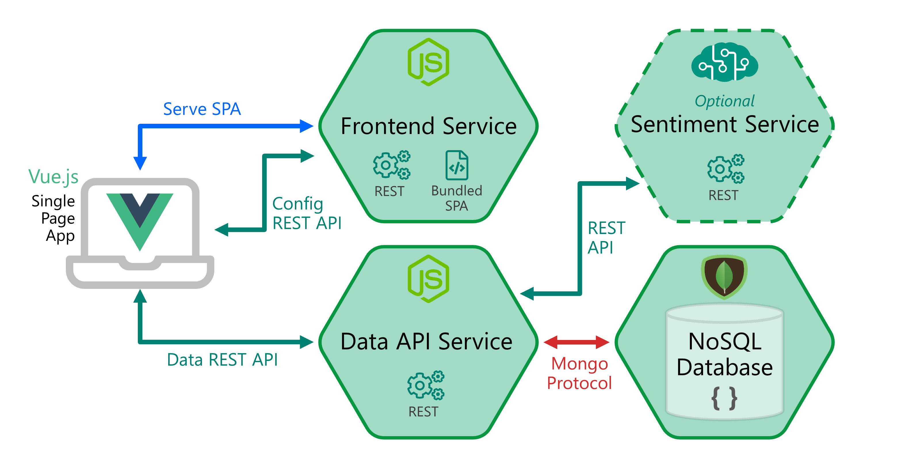

# ❇️ Overview Of The Application

This section simply serves as an introduction to the application, there are no tasks to be carried out.

The application is called 'Smilr' and provides users with a way to rate and provide feedback on events
and other sessions (e.g. hacks, meetups) they have attended. In addition administrators have way to
configure events and view the feedback that has been provided.

## [📃 Smilr - GitHub Repo & Project](https://github.com/benc-uk/smilr)

Screenshot:

<image src="./screenshot.png" style="width:800px" />

The application consists of some lightweight microservices and single page application, it is written
in Node.js + Express and [Vue.js](https://vuejs.org/). The design follows the classic pattern for
running single page apps:

- A frontend service serving static content + configuration API.
- A "backend" data API service for the frontend to consume.
- A MongoDB datastore/database for persisting state.

For this workshop the app will be deployed with the following requirements:

- Both the API and frontend need to be **exposed to the public internet**. Both use HTTP as a protocol.
- The **MongoDB datastore will not be exposed but will run inside the cluster**. Typically you would **NOT** run stateful services inside of the cluster like this, but this is done in the interests of speed and to demonstrate some principals.
- The sentiment service is optional and **won't be deployed**.
- Authentication and API security will disabled and the app will run in "demo mode."

## Navigation

[Return to Main Index 🏠](../readme.md) ‖
[Previous Section ⏪](../02-container-registry/readme.md) ‖ [Next Section ⏩](../04-deployment/readme.md)
