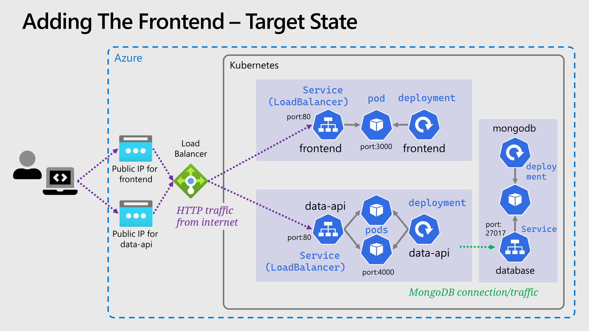

# 💻 Adding The Frontend

We've ignored the frontend until this point, with the API and backend in place we are finally ready to deploy it.
We need to use a _Deployment_ and _Service_ just as before. We can pick up the pace a little and setup everything we need in one go.

For the Deployment:

- The image needs to be `{ACR_NAME}.azurecr.io/smilr/frontend:stable`.
- The port exposed from the container should be **3000**.
- An environmental variable called `API_ENDPOINT` should be passed to the container, this needs to be a URL and should point to the external IP of the API from the previous part, as follows `http://{API_EXTERNAL_IP}/api`.
- Label the pods with `app: frontend`.

For the Service:

- The type of _Service_ should be `LoadBalancer` same as the data API.
- The service port should be **80**.
- The target port should be **3000**.
- Use the label `app` and the value `frontend` for the selector.

You might like to try creating the service before deploying the pods to see what happens.
The YAML you can use for both, is provided below:

`frontend-deployment.yaml`:

<details markdown="1">
<summary>Click here for the frontend deployment YAML</summary>

```yaml
kind: Deployment
apiVersion: apps/v1

metadata:
  name: frontend

spec:
  replicas: 1
  selector:
    matchLabels:
      app: frontend
  template:
    metadata:
      labels:
        app: frontend
    spec:
      containers:
        - name: frontend-container

          image: {ACR_NAME}.azurecr.io/smilr/frontend:stable
          imagePullPolicy: Always

          ports:
            - containerPort: 3000

          env:
            - name: API_ENDPOINT
              value: http://{API_EXTERNAL_IP}/api
```

</details>
</br>

`frontend-service.yaml`:


<details markdown="1">
<summary>Click here for the frontend service YAML</summary>

```yaml
kind: Service
apiVersion: v1

metadata:
  name: frontend

spec:
  type: LoadBalancer
  selector:
    app: frontend
  ports:
    - protocol: TCP
      port: 80
      targetPort: 3000
```

</details>
</br>

As before, the there are changes that are required to the supplied YAML, replacing anything inside `{ }` with a corresponding real value.

## 💡 Accessing and Using the App

Once the two YAMLs have been applied:

- Check the external IP for the frontend is assigned with `kubectl get svc frontend`.
- Once it is there, go to that IP in your browser, e.g. `http://{frontend-ip}/` - the application should load and the Smilr frontend is shown.

If you want to spend a few minutes using the app, you can go to the "Admin" page, add a new event, the details don't matter but make the date range to include the current date.
And try out the feedback view and reports. Or simply be happy the app is functional and move on.

## 🖼️ Cluster & Architecture Diagram

The resources deployed into the cluster & in Azure at this stage can be visualized as follows:



Notice we have **two public IPs**, the `LoadBalancer` service type is not an instruction to Azure to deploy an entire Azure Load Balancer.
Instead it's used to create a new public IP and assign it to the single Azure Load Balancer (created by AKS) that sits in front of the cluster.
We'll refine this later when we look at setting up an ingress.

## Navigation

[Return to Main Index 🏠](../readme.md) ‖
[Previous Section ⏪](../05-network-basics/readme.md) ‖ [Next Section ⏩](../07-improvements/readme.md)
