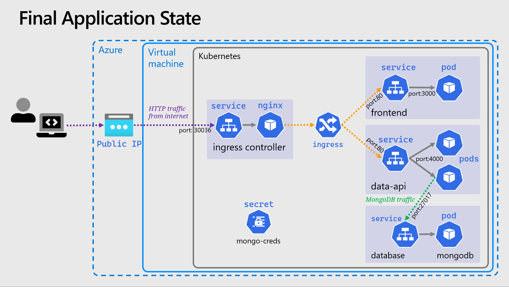

# 🌎 Ingress

For this section we'll touch on a slightly more advanced topic: introducing an ingress controller to our cluster.
The ingress will let us further refine & improve the networking aspects of the app we've deployed.

## 🗃️ Namespaces

So far we've worked in a single _Namespace_ called `default`, but Kubernetes allows you create additional _Namespaces_ in order to logically group and separate your resources.

> 📝 NOTE: Namespaces do not provide a network boundary or isolation of workloads, and the underlying resources (Nodes) remain shared.
> There are ways to achieve these outcomes, but is well beyond the scope of this workshop.

Namespaces are simple idea but they can trip you up, you will have to add `--namespace` or `-n` to any `kubectl` commands you want to use against a particular namespace.
The following alias can be helpful to set a namespace as the default for all `kubectl` commands, meaning you don't need to add `-n`, think of it like a Kubernetes equivalent of the `cd` command.

```bash
# Note the space at the end
alias kubens='kubectl config set-context --current --namespace '
```

and to add to your `.bashrc`

```bash
# Note the space at the end
echo "alias kubens='kubectl config set-context --current --namespace '" >> ~/.bashrc
```

## 🔀 Reconfiguring The App With Ingress

Now we can modify the app we've deployed to route through the new ingress, but a few simple changes are required first.
As the ingress controller will be routing all requests, the services in front of the deployments should be switched back to internal i.e. `ClusterIP`.

- Edit both the data API & frontend **service** YAML manifests, change the service type to `ClusterIP`
  and remove `nodePort` field then reapply with `kubectl apply`.
- Edit the frontend **deployment** YAML manifest, change the `API_ENDPOINT` environmental variable to
  use the same origin URI `/api` no need for a scheme or host.

Apply these three changes with `kubectl` and now the app will be temporarily unavailable. Note, if you have changed namespace with `kubens` you should switch back to the **default** namespace before running the apply.

## 🚀 Deploying The Ingress Controller

An [ingress controller](https://kubernetes.io/docs/concepts/services-networking/ingress-controllers/) provides a reliable and secure way to route HTTP and HTTPS traffic into your cluster and expose your applications from a single point of ingress; hence the name.


- The controller is simply an instance of a HTTP reverse proxy running in one or mode _Pods_ with a _Service_ in front of it.
- It implements the [Kubernetes controller pattern](https://kubernetes.io/docs/concepts/architecture/controller/#controller-pattern)
  scanning for _Ingress_ resources to be created in the cluster, when it finds one, it reconfigures itself based on the rules and configuration within that _Ingress_, in order to route traffic.
- There are [MANY ingress controllers available](https://kubernetes.io/docs/concepts/services-networking/ingress-controllers/#additional-controllers)
  but we will use a very simple one, the [bare-metal ingress controller](https://kubernetes.github.io/ingress-nginx/deploy/#bare-metal-clusters), this uses type `NodePort` services, instead of `LoadBalancer`.
- Often TLS is terminated by the ingress controller, and sometimes other tasks such as JWT validation for authentication can be done at this level.
  For the sake of this workshop no TLS & HTTPS will be used due to the dependencies it requires (such as DNS, cert management, etc.).

To greatly simplify this, we'll be getting the yaml from the url within the [bare-metal ingress controller](https://kubernetes.github.io/ingress-nginx/deploy/#bare-metal-clusters) page with the below command:

```sh
curl https://raw.githubusercontent.com/kubernetes/ingress-nginx/controller-v1.3.0/deploy/static/provider/baremetal/deploy.yaml -o ingress-controller.yaml
```

And now we just need to modify the above yaml to use a specific `nodePort` instead of a randomly assigned one.
In the `ingress-controller.yaml` find the `NodePort` service and in the `appProtocol:http` add `nodePort` with port `30036`.

Here's a snippet from `ingress-controller.yaml` with the new `nodePort`:

```yaml
---
spec:
  ports:
    - appProtocol: http
      name: http
      port: 80
      protocol: TCP
      targetPort: http
      nodePort: 30036 # This is the newly added line
    - appProtocol: https
      name: https
      port: 443
      protocol: TCP
      targetPort: https
  selector:
    app.kubernetes.io/component: controller
    app.kubernetes.io/instance: ingress-nginx
    app.kubernetes.io/name: ingress-nginx
  type: NodePort
```

Apply the `ingress-controller.yaml` as usual with:

```sh
kubectl apply -f ingress-controller.yaml
```

From the output of the apply, you may notice that our controller has been created in a new namespace: `namespace/ingress-nginx created`.

Check the status of both the pods and services with `kubectl get svc,pods --namespace ingress-nginx`,
ensure the pods are running and the `ingress-nginx-controller` service has port `80:30036/TCP` assigned to it in the output.

## 🔀 Configuring Ingress

The next thing is to configure the ingress by [creating an _Ingress_ resource](https://kubernetes.io/docs/concepts/services-networking/ingress/).
This can be a fairly complex resource to set-up, but it boils down to a set of HTTP path mappings (routes) and which backend service should serve them.
Here is the completed manifest file `ingress.yaml`:

<details markdown="1">
<summary>Click here for the Ingress YAML</summary>

```yaml
apiVersion: networking.k8s.io/v1
kind: Ingress

metadata:
  name: my-app
  labels:
    name: my-app

spec:
  # Important we leave this blank, as we don't have DNS configured
  # Blank means these rules will match ALL HTTP requests hitting the controller IP
  host:
  # This is important and required since Kubernetes 1.22
  ingressClassName: nginx
  rules:
    - http:
        paths:
          # Routing for the frontend
          - pathType: Prefix
            path: "/"
            backend:
              service:
                name: frontend
                port:
                  number: 80

          # Routing for the API
          - pathType: Prefix
            path: "/api"
            backend:
              service:
                name: data-api
                port:
                  number: 80
```

</details>

Apply the same as before with `kubectl`, validate the status with:

```bash
kubectl get ingress
```

Now both applications should be running on: `http://{VM_IP}:30036`

Visit the above url in your browser, if you check the "About" screen and click the "More Details" link it should take you to the API, which should now be served from the same IP as the frontend.

## 🖼️ Cluster & Architecture Diagram

We've reached the final state of the application deployment.
The resources deployed into the cluster and in Azure at this stage can be visualized as follows:



This is a slightly simplified version from previously, and the _Deployment_ objects are not shown.

## Navigation

[Return to Main Index 🏠](../../readme.md)
[Previous Section ⏪](../07-improvements/readme.md) ‖ [Next Section ⏩](../09-extra-advanced/readme.md)
