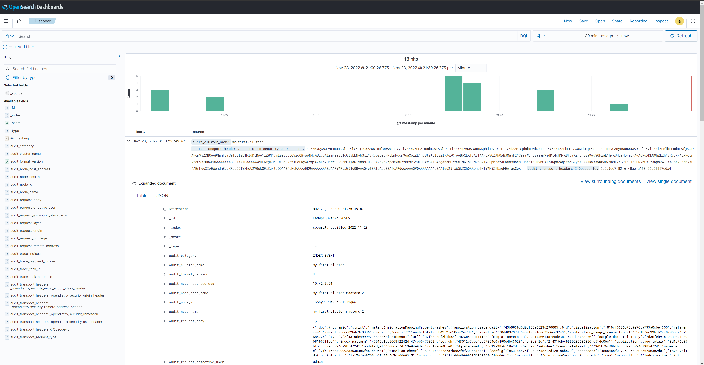

Table of Contents
=================

- [Table of Contents](#table-of-contents)
- [OpenSearch-k8s-operator](#opensearch-k8s-operator)
  - [How does the operator work](#how-does-the-operator-work)
  - [Installation](#installation)
  - [Deploying a new OpenSearch cluster](#deploying-a-new-opensearch-cluster)
- [Fluent bit](#fluent-bit)
  - [Installation](#installation-1)
- [OpenSearch Dashboards](#opensearch-dashboards)
- [Reference links](#reference-links)

# OpenSearch-k8s-operator

The Kubernetes OpenSearch Operator is used for automating the deployment, provisioning, management, and orchestration of OpenSearch clusters and OpenSearch dashboards.

Using the Operator makes scaling up and down, version upgrades, rolling restarts, adjustment of memory and disk resources on the nodes, securing deployments, and managing certificates simplified and streamlined.

The Operator consists of tho main parts :

1) CRD --> Custom Resource Definition which declares the OpenSearch cluster.
2) Operator manager (itself!)

## How does the operator work

The OpenSearch operator follows the normal kubernetes operator model.

It is controlled by several Custom Resources (CR), defined in Kubernetes using a Custom Resource Definition (CRD), that act as the API/interface for the operator.

This approach integrates the operator into the normal declarative model and thinking of the Kubernetes API, making it easy to use and automate.

The main resource offered by the operator is called `OpenSearchCluster` and is a spec for an OpenSearch cluster to be deployed in kubernetes. 

Additional resources are `OpensearchRole`, `OpensearchUser` and `OpensearchUserRoleBinding` which expose a declarative API to managing users and roles in OpenSearch.

For each custom resource the operator runs a controller. This controller connects to the kubernetes API and watches for changes in custom objects belonging to its custom resource (for example a newly created `OpenSearchCluster` object). 

For each object a reconcile loop is started and the main `Reconcile` method is called. This main method acts as an orchestrator and calls a number of reconcilers. 

Each reconciler is responsible for one aspect of managing an OpenSearch cluster (for example there is one that deals with deploying the dashboards instance and one dealing with the management of the securityconfig). 

The reconcile run is repeated regularly (called requeing) so that the reconcilers can react to any changes to the cluster. In case the custom object is changed a new reconcile run is triggered immediately.

## Installation

In this section, we are going to install operator in kubernetes cluster.

We are going to use [Opster / opensearch-k8s-operator](https://github.com/Opster/opensearch-k8s-operator) repository which is also uploaded to [ArtifactHub](https://artifacthub.io/packages/helm/opensearch-operator/opensearch-operator) (similar to OperatorHub). It's just an artifact that knows how to save kubernetes helm packages.

Using helm chart:

We will change directory:

```shell
cd opensearch-operator
```

By running below command, it will install the manager that operates all the OpenSearch Operator's actions:

```shell
helm install my-opensearch-operator . -f values.yaml
```

The chart has deployed in the environment.

Output:
```Output
NAME: my-opensearch-operator
LAST DEPLOYED: Wed Nov 23 14:44:51 2022
NAMESPACE: opensearch
STATUS: deployed
REVISION: 1
TEST SUITE: None
```

The below command will show us the status of the chart deployment.
```shell
helm ls
```

Output:
```Output
NAME                    NAMESPACE       REVISION        UPDATED                                 STATUS          CHART                           APP VERSION
my-opensearch-operator  opensearch      1               2022-11-23 14:44:51.904455841 +0530 IST deployed        opensearch-operator-2.1.1       2.1.1
```

Now, we will check what has been deployed:

```shell
kubectl get all
```

Output:
```Output

NAME                                                          READY   STATUS    RESTARTS   AGE
pod/opensearch-operator-controller-manager-6f6f5bdf49-nndfz   2/2     Running   0          6m22s

NAME                                                             TYPE        CLUSTER-IP      EXTERNAL-IP   PORT(S)    AGE
service/opensearch-operator-controller-manager-metrics-service   ClusterIP   10.43.137.113   <none>        8443/TCP   6m23s

NAME                                                     READY   UP-TO-DATE   AVAILABLE   AGE
deployment.apps/opensearch-operator-controller-manager   1/1     1            1           6m23s

NAME                                                                DESIRED   CURRENT   READY   AGE
replicaset.apps/opensearch-operator-controller-manager-6f6f5bdf49   1         1         1       6m23s
```

To check CRD installation: 

```shell
kubectl get crd | grep opensearch
```

Output:

```Output
NAME                                                  CREATED AT
opensearchclusters.opensearch.opster.io               2022-11-23T09:14:59Z
opensearchroles.opensearch.opster.io                  2022-11-23T09:14:58Z
opensearchuserrolebindings.opensearch.opster.io       2022-11-23T09:14:58Z
opensearchusers.opensearch.opster.io                  2022-11-23T09:14:58Z
```

##  Deploying a new OpenSearch cluster

 Review `opensearch-v2-cluster.yaml` and create the resources by running following command:

```shell
kubectl apply -f opensearch-v2-cluster.yaml
```


By running following command we can see opensearch cluster name:

```shell
kubectl get opensearch
```

To access the OpenSearch REST API, run: 

```shell
kubectl port-forward svc/my-first-cluster 9200
```

Then open a second terminal and run:

```shell
curl -k -u admin:admin https://localhost:9200/_cat/nodes?v
```

You should see the three deployed pods listed. (You can also see in the browser by typing `https://localhost:9200/_cat/nodes?v` URL.)


# Fluent bit

Fluent bit workflow is to collect, parse, filter and ship logs to a central place. One of the critical phases of may is the ability to do *buffering*.

Buffering is a mechanism to place processed data into a temporary location until is ready to be shipped.

By default when Fluent Bit processes data, it uses Memory as a primary and temporary place to store the records, but there are certain scenarios where it would be ideal to have a persistent buffering mechanism based in the filesystem to provide aggregation and data safety capabilities.

## Installation

In this section, we are going to install fluent bit in kubernetes cluster.

Create `fluent-bit` folder:

```shell
mkdir fluent-bit
```

Pull fluent-bit helm chat:

```shell
 helm pull fluent/fluent-bit
```

You will see `fluent-bit-0.21.3.tgz` in your directory:

```shell
ls
```

Extract to fluent-bit folder:

```shell
 tar -xvzf fluent-bit-0.21.3.tgz -C fluent-bit
```

Delete `fluent-bit-0.21.3.tgz`:

```shell
rm -rf fluent-bit-0.21.3.tgz
```

Change directory to `fluent-bit` folder:

```shell
cd fluent-bit
```

Install `fluent-bit` by running below command:

```shell
helm install fluentbit . -f values.yaml
```

Get the status of the resources:

```shell
kubectl get all | grep fluent
```

Check logs for one of the `fluent-bit` pod:

```shell
k logs fluentbit-fluent-bit-9kk58
```

Truncated output:
```Output
[ info] [storage] ver=1.3.0, type=memory+filesystem, sync=normal, checksum=off, max_chunks_up=128
[storage] backlog input plugin: storage_backlog.2
[ info] [input:tail:tail.0] storage_strategy='filesystem' (memory + filesystem)
```

# OpenSearch Dashboards

We can login to OpenSearch Dashboards by running:

```shell
kubectl port-forward svc/my-first-cluster-dashboards 5601
```

Open [https://localhost:5601](https://localhost:5601/) in the browser and log in with the default demo credentials `admin / admin`.

Click on Menu button (hamburger button) on top left side, Navigate to `Management` > `Stack Management` > `Index Patterns` and follow below images for the next steps:


Go to the **OpenSearch Dashboards** > **Discover** to visualize the logs:



# Reference links

[Kubernetes Operator for OpenSearch](https://opensearch.org/blog/technical-post/2022/04/launching-open-source-operator-for-openSearch/)

[OpenSearch-k8s-operator github repository](https://github.com/Opster/opensearch-k8s-operator)

[Buffering & Storage](https://docs.fluentbit.io/manual/administration/buffering-and-storage)